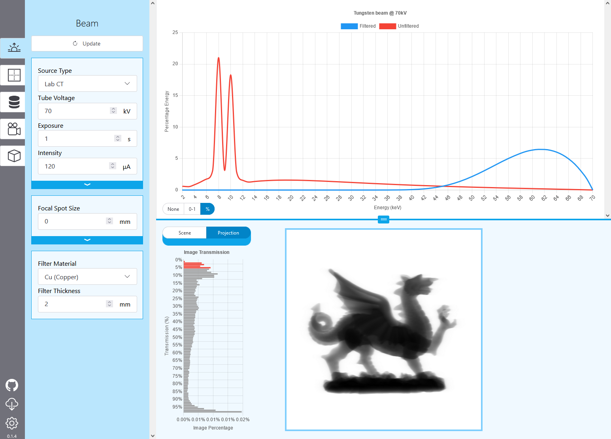

---

WebCT is a feature-rich environment for previewing and simulating X-ray scans on the browser.

- Configure and see output spectra in real-time, with support for different physical filters.
- Upload any 3D model, along with editable materials.
- Change capture parameters to see the effect projections have on the reconstruction quality.
- Reconstruct your scans, and tweak for the best results!
- Save and export your configuration, share source and detector parameters and load them into other applications.


> [!NOTE]
> 🏗 WebCT is still in development, and while most features are implemented, some are still a work-in-progress. [Feel free to request features, and report bugs.](https://github.com/WebxCT/WebCT/issues) WebCT aims to be a useful tool for everyone, if there is something you'll like to see, please request it!

## What WebCT *isn't*

Although webCT aims to provide an all-in-one solution for simulation and
reconstruction, a few aspects that WebCT does not cover:

- Data analysis tool - *Export data from WebCT*
- Batch processor - *Export configs & use gVirtualXRay*
- Model editor - *Use 3D software like blender*
- Large Data Processor - *WebCT is not optimised for large datasets*

WebCT does however, aim to facilitate the above with config and dataset exporting.

## Installing WebCT
> [!IMPORTANT]
> Hosting WebCT requires a NVIDIA graphics card, as a dependency for tomographic reconstruction.

[](https://github.com/WebxCT/WebCT/releases/download/v1.0.0/WebCT-v1.0.0.zip)

Download and extract the folder, double-click WebCT.exe to launch!

For Linux users, [follow the Development setup](#developing-webct).

## Quickstart Video

<!-- Stripped by github (why?)-->
<video controls src="doc/videos/WebCT-Quick%20Introduction.mp4"></video>

<!-- Workaround for github;- display hyper-compressed video -->
https://github.com/user-attachments/assets/915f300f-aa59-42ff-bb4b-5e89871ff650

*Music: [Turning Along - The Flashbulb](https://theflashbulb.bandcamp.com/album/piety-of-ashes) (please support the artist!)*


## Developing WebCT

1. Pull the repository from github however you like
2. Install the conda environment with `conda env create`
3. Install [npm by downloading node.js with fnm](https://nodejs.org/en/download/package-manager)
4. Install js packages with `npm install`
5. Build and host webserver with `npm run serve`
	- If flask fails to start, ensure the webct environment is activated with `conda activate webct`
6. Visit the local url in a browser! (This should open automatically)

Any issues with installing? [Please feel free to open an issue!](https://github.com/WebxCT/WebCT/issues)

## Citing WebCT

If you use WebCT in an academic context, please cite our paper! [We have an open-access academic paper in Tomography of Materials and Structures.](https://doi.org/10.1016/j.tmater.2025.100057)

Cite as text:
```
I. T. Mitchell, J. M. Létang, L. M. Evans, F. P. Vidal, WebCT – OpenSource web-based GUI for real-time X-ray simulation, Tomography of Materials and Structures 8 (2025). doi:10.1016/j.tmater.2025.100057
```

Or as Bibtex:
```bibtex
@article{MITCHELL2025100057,
title = {WebCT – OpenSource web-based GUI for real-time X-ray simulation},
journal = {Tomography of Materials and Structures},
volume = {8},
year = {2025},
doi = {10.1016/j.tmater.2025.100057},
author = {Iwan T. Mitchell and Jean Michel Létang and Llion Marc Evans and Franck P. Vidal},
keywords = {X-ray Simulation, Computational modelling, X-ray computed tomography (XCT), Non-destructive testing (NDT), Synchrotron tomography, User Interface (UI), Experimental Planning},
}
```
